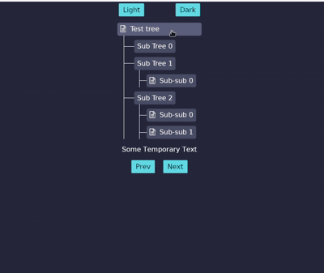

# Widgets

This repository contains custom `Iced` widgets and experimental UI components 
for the [modav project](https://github.com/EmmanuelDodoo/modav).

### Table

A table widget


You can run it with `cargo run`;

```
cargo run --example table
``` 

### Tree

A vertical collapsible tree wigdet with tabing functionality.



You can run it with `cargo run`;

```
cargo run --example tree
```
